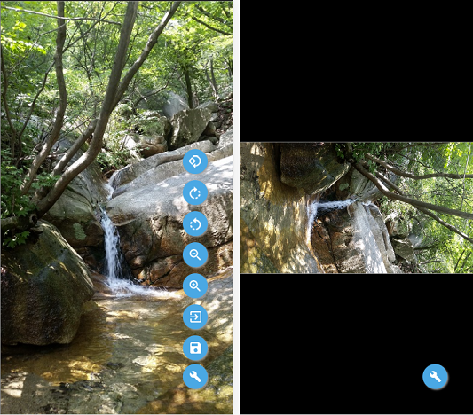

## Simple Image Editor for Mobile ##

This is a JavaScript library that provides the ability to easily edit images on mobile.

Demo: [https://gujc71.github.io/imageEditor9/example.html](https://gujc71.github.io/imageEditor9/example.html)

### Added features ###
- Full Screen mode
- Rotate & Resize image
- Zoom In / Out
- Rotate image

### License ###
MIT

